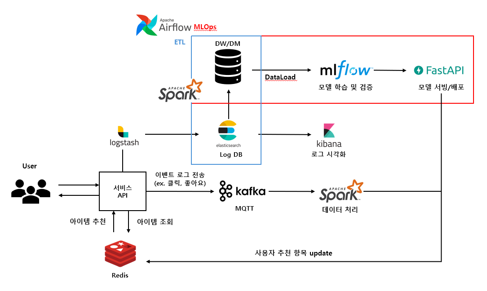
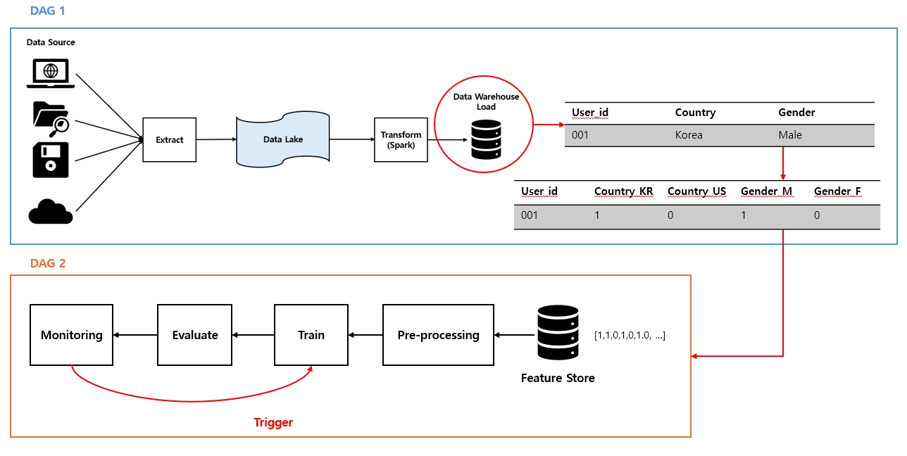

# AI 기반 추천 시스템을 위한 데이터 파이프라인 & MLOps 구축

본 프로젝트는 사용자 행동 로그를 기반으로 하는 추천 시스템을 AI로 자동화하기 위한 **엔드-투-엔드 MLOps 파이프라인**입니다. 서비스에 도입될 수 있는 수준의 구조를 목표로, 데이터 수집부터 전처리, 학습, 평가, 배포, 모니터링까지 전 과정을 구성하였습니다.

---

## 🔧 시스템 아키텍처 (서비스 중심)

<p align="center">
  
</p>

위 그림은 사용자 서비스에서 발생하는 이벤트가 어떻게 AI 모델 학습 및 추천에 연결되는지를 설명합니다.

- **사용자 서비스**에서 발생한 이벤트(조회, 클릭 등)는 **MQTT**를 통해 실시간 수집됩니다.
- 수집된 **로그 데이터는 Elasticsearch에 저장**되고, Kibana 등을 통해 시각화됩니다.
- 동시에 **Logstash/Filebeat**를 통해 로그를 전송하며, 컨테이너 환경에서 **Spark 처리**를 통해 실시간 혹은 배치 처리로 변환됩니다.
- **추천 요청이 들어오면** API는 MLflow registry에서 모델을 불러와 Inference를 수행하고, **추천 결과**를 사용자에게 반환합니다.
- 추천 속도를 개선하기 위해 **Redis 캐시에 미리 예측값을 저장**해두고, 사용자 접속 시 캐시에서 빠르게 반환하는 구조도 포함되어 있습니다.
- 홈피드는 일부 추천 결과를 배치로 미리 계산하고, 일부는 사용자의 최신 행동을 반영해 실시간으로 재정렬하는 **하이브리드 방식**을 따릅니다.

---

## 🧠 MLOps 파이프라인 아키텍처 (모델 생애주기 중심)

<p align="center">
  
</p>

위 그림은 추천 모델의 학습과 재학습, 배포, 모니터링에 이르는 **AI 생애 주기 전체 흐름**을 나타냅니다.

- **ETL 파이프라인**
  - 사용자 로그는 원본 그대로 **Data Lake**에 저장됩니다.
  - 이후 Spark를 활용해 **데이터 변환: Transform**을 수행하고, **Data Warehouse**에 적재됩니다.
- **Feature Engineering**
  - 학습에 필요한 피처를 추출하여 **Feature Store**에 저장
- **모델 학습 및 평가**
  - PyTorch 기반의 모델을 학습하고,
  - MLflow를 이용해 학습 결과 및 하이퍼파라미터, 성능 지표를 기록
  - 일정 기준 이상의 성능을 만족할 경우 **MLflow Registry에 등록**
- **Airflow 기반 DAG 자동화**
  - 데이터 수집, 전처리, 학습, 배포, 평가 등 모든 단계는 Airflow DAG으로 자동화되어 주기적 재학습이 가능합니다.
- **모니터링 및 트리거링**
  - Prometheus로 예측 정확도 및 지표를 수집하고, 기준 이하일 경우 재학습을 트리거하도록 설계되어 있습니다.

---

## 🛠 기술 스택 요약

| 구성 요소 | 사용 기술 |
|-----------|-----------|
| 데이터 수집 | Kafka, Filebeat (설계) |
| 데이터 처리 | Apache Spark |
| 데이터 저장 | MinIO, PostgreSQL |
| 모델 학습 | PyTorch, MLflow |
| 워크플로우 자동화 | Apache Airflow |
| 모니터링 | Prometheus, alertmanager |
| 모델 서빙 | FastAPI, Redis |

---

## 📦 실행 방법

```bash
# 프로젝트 실행
docker-compose up --build

docker exec -it <spark-master-컨테이너명> spark-submit \
  --master spark://spark:7077 \
  --packages org.apache.spark:spark-sql-kafka-0-10_2.12:3.5.3 \
  /opt/bitnami/spark/work/stream_inference.py


# Airflow UI 접속: http://localhost:8080
# MLflow Tracking UI: http://localhost:5000
```
